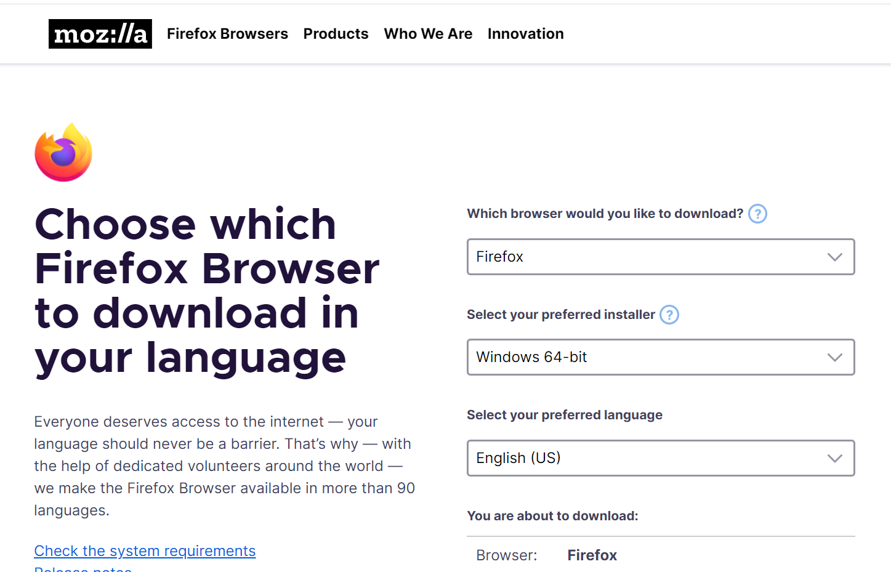

Why do I need offline installer of Firefox?

Because it's online installer is too slow. (Yes the installer that you download from its index page is online 
installer, basically it's just a downloader, that
when you run it, it just downloads the offline installer and install it for you. If you don't feel it's slow, 
then you don't need to read this post.)
And maybe the online installer even uses P2P so when it will also upload to others while installing.

So in this [Firefox offline installer download page](https://www.mozilla.org/en-US/firefox/all/#product-desktop-release), 
you can pick any version for any OS to download
the Firefox, like Firefox Developer Edition, Firefox Beta, for Mac, for Windows, fore Linux and even for Android mobile.

And, here is also [Chrome release channels](http://www.chromium.org/getting-involved/dev-channel), where you can 
download several chrome versions, like Chrome Dev version, Beta, and Canary, for different OS. 

Like me, I like running different profile in different versions of Chrome and Firefox, because their icon are different 
,easier than check the profile name in the top right corner.

