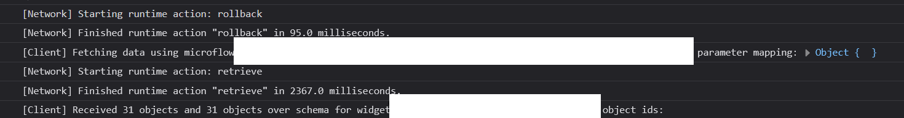
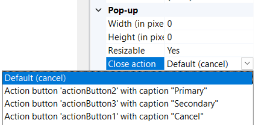
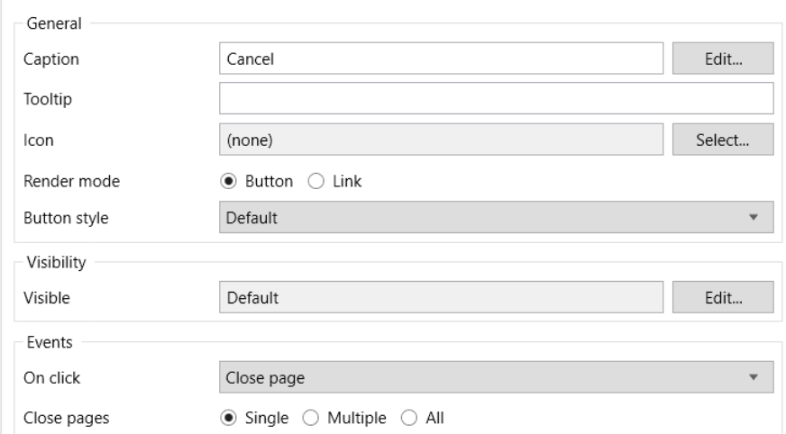

Our tester engineer recently reported an issue where in a Mendix app,  it takes more than 3 seconds to close a popup after clicking the close button.

We looked closely at the log and found that it always does some rollback and fetching before actually closing the modal. 

 
We found that the default Close action for the modal is Cancel, which means cancel changes that are not committed in Mendix. This explains why it triggers rollback and retrieve before closing, even though no changes have been made. 

To fix this, you can change the Close action to *Close Page*. 
 
However, there is no Close page in the list. There are some options that are bound to other buttons in the modal.

So you have to add a button in the modal, bind close page action to the button, and change the Close action of the model to the button. 

Sometimes you don’t need this extra button shown in the modal; you can just give it a hidden style, like adding `display:none` style in its appearance tab.

---EOF---