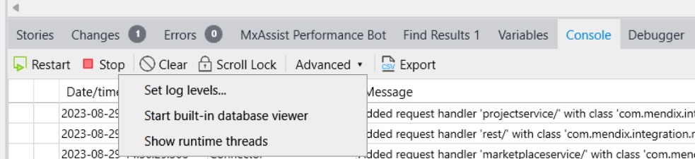
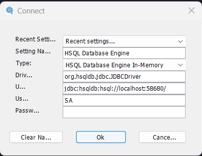
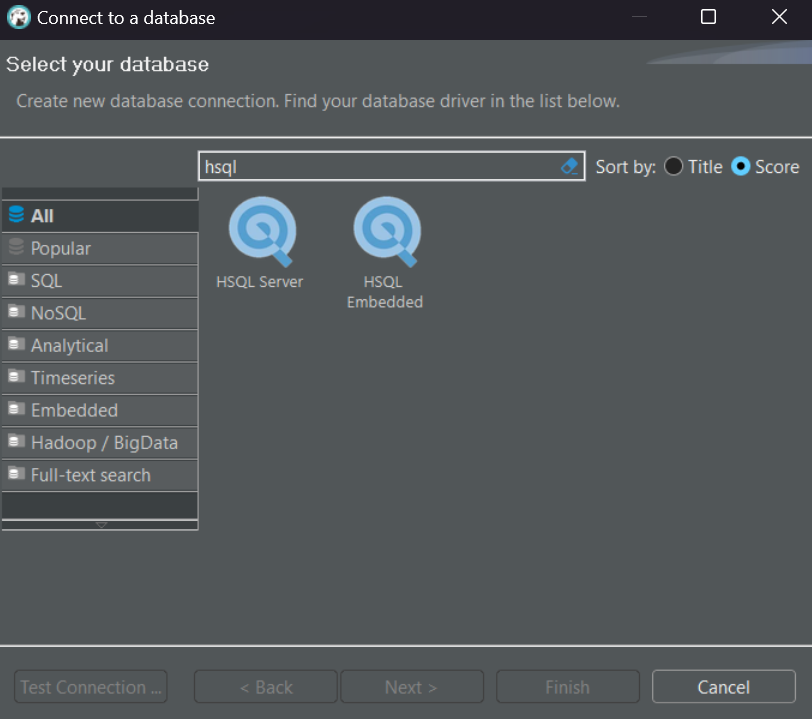
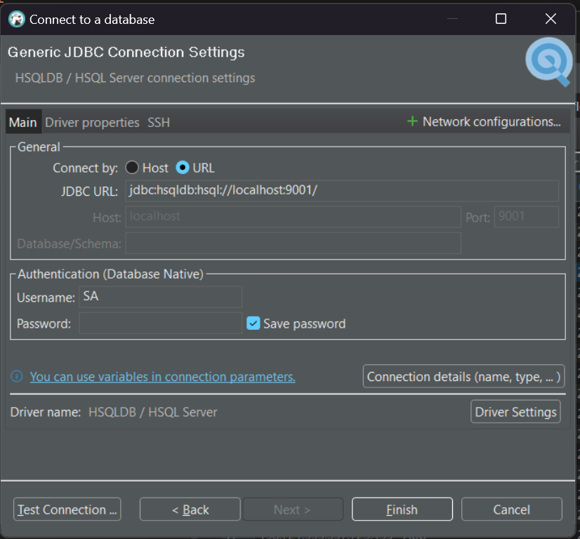

By default, Mendix project is using HSQL as the database. 

If you want to check the db tables and data, you can simply do this:

- start the project from Mendixo Studio Pro
- in the console tab, you will find a sub tab `Advanced`
- click it will open a menu, there is a item `start built-in database viewer`

A database viewer will open, it has simple and basic UI, which you can check all the tables or you project. and do query, delete actions easily.

And you can also run SQL in it.

Well, this is nice. but it's a bit too simple. 

Sometimes, especially for those who has more development experience and has own favorite data viewer like MySql workbench, or DBeaver, how to use them to view the Mendix project's database.

It's also simple.

Let's take DBeaver as example.

- open the built-in db viewer in Mendix Studio Pro.

- Click `File` - `Connect`, this will open a small window. 

- In this window, it shows the connect info of current project's dababase, let's call this window `SP Window` for referrence. 

- Now open DBeaver

- Click the new connection icon, in the popup window, type `HSQL` to search, and pick `HSQL Server`

- Click `next`. in next window, select `URL`, copy the `jdbc...` value in the SP Window as the `JDBC URL` in DBeaver

- For the `Username` and `Password` just use the same one in the SP Window

- Click `Finish`

You are done, now you can play with the Mendix project database with DBeaver

---EOF---